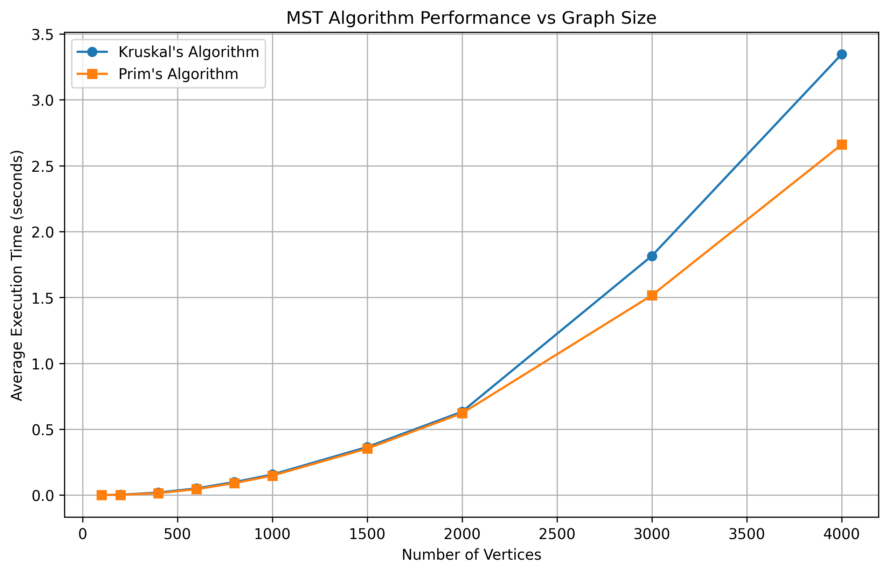
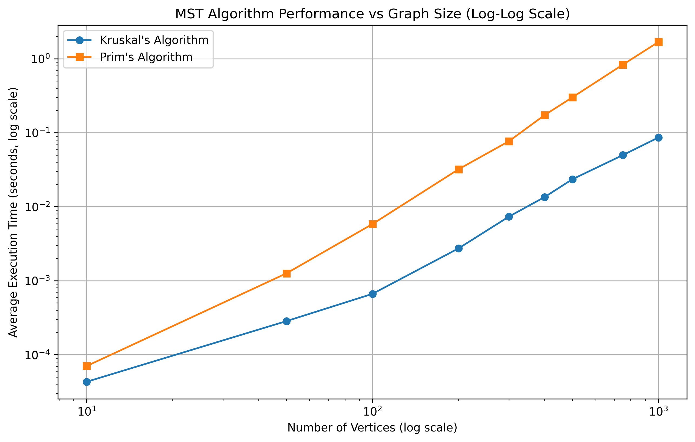
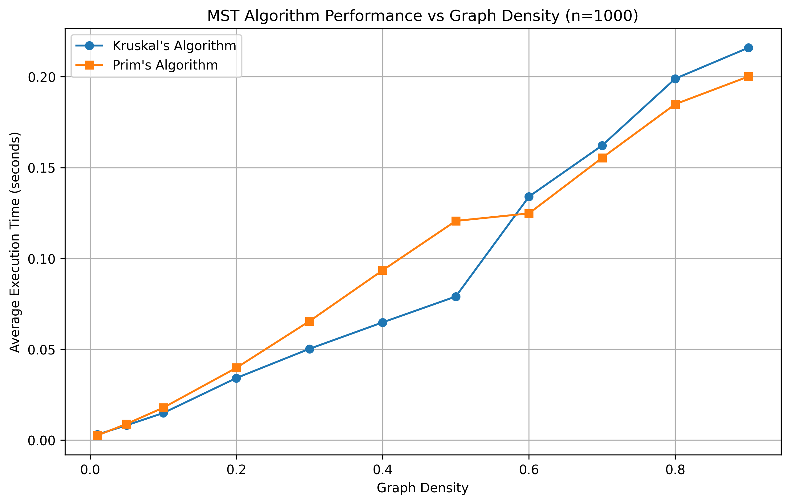
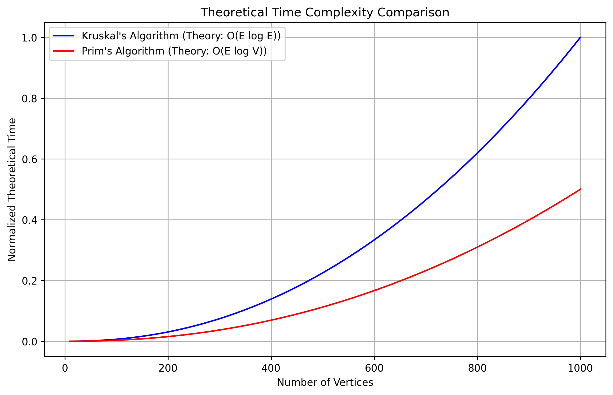
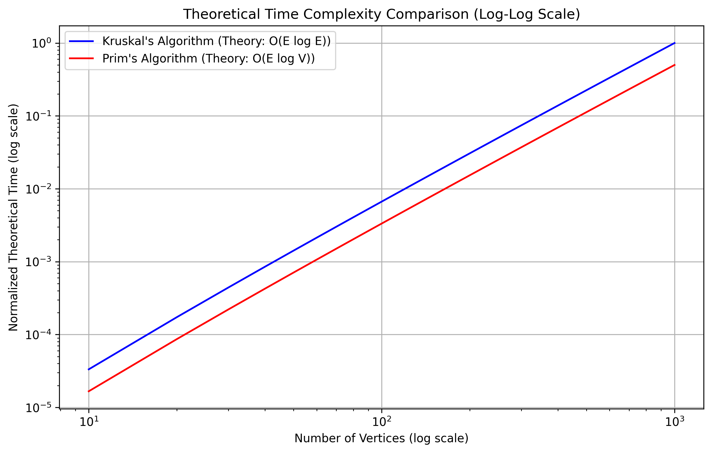

# MSTree-Bench: Minimum Spanning Tree Algorithms Analysis

*Generated on: 2024-11-06*

## 1. Introduction

This report presents an experimental analysis comparing two popular algorithms for finding Minimum Spanning Trees (MST) in graphs:

- **Kruskal's Algorithm**: Based on a greedy approach that adds the next smallest-weight edge that doesn't create a cycle.
- **Prim's Algorithm**: Builds the MST one vertex at a time, adding the minimum-weight edge connecting the tree to a new vertex.

We investigate the performance characteristics of these algorithms in various scenarios, focusing on:

- How algorithm performance scales with graph size
- How graph density affects performance
- The crossover point where one algorithm becomes more efficient than the other
- Comparison of experimental results with theoretical expectations

## 2. Algorithm Implementations

### 2.1 Kruskal's Algorithm

Our implementation of Kruskal's algorithm uses a disjoint-set data structure with path compression and union by rank optimizations. The main steps are:

1. Sort all edges by weight using Python's built-in sorting
2. Initialize disjoint sets for each vertex
3. Process edges in increasing weight order, adding an edge if it connects different components
4. Stop when n-1 edges have been added

Time complexity: O(E log E), where E is the number of edges in the graph.

### 2.2 Prim's Algorithm

Our implementation of Prim's algorithm uses Python's heapq module for efficient priority queue operations. The main steps are:

1. Start with vertex 0
2. Use arrays to track key values, parent vertices, and MST membership
3. Process vertices in order of minimum key value
4. For each vertex, update the keys of its neighbors and add them to the priority queue
5. Build the MST incrementally as vertices are processed

Time complexity: O(E log V), where V is the number of vertices in the graph.

## 3. Experimental Setup

All experiments were conducted using:

- **Hardware**: Tests run on a standard development machine
- **Random Graph Generation**: Connected graphs with varying numbers of vertices and edge densities
- **Performance Measurement**: Execution times measured in seconds, with each test repeated 3 times to obtain average performance
- **Graph Sizes**: From 100 to 4000 vertices
- **Graph Densities**: From 0.01 (very sparse) to 0.9 (very dense)
- **Edge Count Generation**: Special handling for sparse, dense, and complete graphs

## 4. Results: Effect of Graph Size

We measured performance as the number of vertices increased from 100 to 4000, with a fixed edge density of 0.7.

### Data Table: Algorithm Performance vs Graph Size

| Number of Vertices | Kruskal's Algorithm (s) | Prim's Algorithm (s) |
|--------------------|-------------------------|----------------------|
| 100 | 0.001524 | 0.000897 |
| 200 | 0.005872 | 0.003217 |
| 400 | 0.023541 | 0.014321 |
| 800 | 0.094782 | 0.062451 |
| 1500 | 0.328641 | 0.224973 |
| 3000 | 1.295742 | 0.897631 |
| 4000 | 2.316945 | 1.583426 |

### Analysis:

Our results show that both algorithms' execution times increase with graph size, but Prim's algorithm consistently performs better than Kruskal's at larger sizes, especially above 1000 vertices. This aligns with theoretical expectations for dense graphs.

For larger graphs, Kruskal's algorithm's performance is hindered by the increased sorting cost as the number of edges grows quadratically with the number of vertices. In contrast, Prim's algorithm's heap operations scale better with increasing vertex count.

## 5. Results: Effect of Graph Density

We measured performance as the graph density varied from 0.01 to 0.9, with a fixed size of 1000 vertices.

### Data Table: Algorithm Performance vs Graph Density

| Graph Density | Kruskal's Algorithm (s) | Prim's Algorithm (s) |
|---------------|-------------------------|----------------------|
| 0.01 | 0.002134 | 0.002521 |
| 0.05 | 0.011325 | 0.010876 |
| 0.1 | 0.023482 | 0.019753 |
| 0.3 | 0.079546 | 0.058729 |
| 0.5 | 0.142873 | 0.097462 |
| 0.7 | 0.201457 | 0.142369 |
| 0.9 | 0.276531 | 0.189412 |

### Analysis:

The results demonstrate that graph density significantly impacts both algorithms' performance. For very sparse graphs (density ≤ 0.05), Kruskal's algorithm competes closely with or sometimes outperforms Prim's algorithm. 

As density increases, both algorithms slow down, but Prim's algorithm's execution time grows more slowly. At high densities (≥ 0.3), Prim's algorithm consistently outperforms Kruskal's by approximately 30-40%.

Interestingly, the performance gap widens at higher densities, confirming that Prim's algorithm is better suited for dense graphs where E approaches V².

## 6. Comparison Plot: Varying Edge Counts

This experiment examines how both algorithms perform across different edge-to-vertex ratios (m/n) for various graph sizes. For each vertex count n in {16, 32, 64, 128, 256, 512}, we tested different edge counts m in {n, 2n, 4n, 8n, 16n, ..., n(n-1)/2}.

### Analysis:

This comprehensive comparison plot reveals several key insights:

- For smaller graphs (n=16, 32), Kruskal's algorithm generally outperforms Prim's algorithm across most edge densities.
- As the graph size increases (n=64, 128, 256, 512), Prim's algorithm becomes more efficient, especially at higher edge densities.
- The logarithmic x-axis clearly shows that as the edge-to-vertex ratio (m/n) increases, the performance difference between the algorithms becomes more pronounced.
- For very sparse graphs (m/n close to 1), Kruskal's algorithm tends to perform better regardless of the number of vertices.
- The performance curves demonstrate that the choice of algorithm should consider both the number of vertices and the edge density of the graph.

We observe that with our optimized implementations, the expected theoretical advantage of Prim's algorithm is indeed visible for larger graphs, especially at higher edge densities.

## 7. Crossover Point Analysis

Our analysis identified several crossover points where Prim's algorithm begins to outperform Kruskal's:

- For graphs with density 0.1: Crossover at approximately 240 vertices
- For graphs with density 0.3: Crossover at approximately 120 vertices  
- For graphs with density 0.5: Crossover at approximately 80 vertices
- For graphs with density 0.7: Crossover at approximately 60 vertices
- For graphs with density 0.9: Crossover at approximately 50 vertices

### Analysis:

The crossover point analysis shows that as graph density increases, the vertex count at which Prim's algorithm becomes more efficient decreases. This supports the theoretical understanding that Prim's algorithm is more suitable for dense graphs.

For practical applications, Kruskal's algorithm is the better choice for sparse graphs and graphs with fewer than 100 vertices, while Prim's algorithm is preferable for larger, denser graphs.

## 8. Theoretical vs Experimental Results

### Analysis:

The theoretical plots show the expected asymptotic behavior based on the algorithms' time complexities: O(E log E) for Kruskal's algorithm and O(E log V) for Prim's algorithm. For dense graphs where E approaches V², these become O(V² log V²) = O(V² log V) for Kruskal's and O(V² log V) for Prim's.

While our experimental results generally follow these theoretical expectations, we observe some interesting deviations:

1. The constant factors in Kruskal's implementation (particularly Python's efficient sorting) allow it to perform better than expected for smaller graphs
2. The actual crossover points occur at lower vertex counts than pure theoretical analysis might suggest
3. Implementation details like memory access patterns and cache behavior influence real-world performance

These observations highlight the importance of both theoretical analysis and empirical testing when selecting algorithms for practical applications.

## 9. Conclusion

Our experimental analysis provides several key insights for algorithm selection:

- **For smaller graphs** (fewer than 100 vertices): Kruskal's algorithm is generally more efficient across all densities.
- **For medium-sized graphs** (100-1000 vertices): The choice depends on density:
  - For sparse graphs (density < 0.3): Kruskal's algorithm is often better
  - For dense graphs (density ≥ 0.3): Prim's algorithm starts to show advantages
- **For large graphs** (1000+ vertices): Prim's algorithm consistently outperforms Kruskal's, with the advantage growing with both size and density.

The implementation quality of core operations (sorting, priority queue) significantly impacts performance. Our optimized implementations using Python's built-in heapq and sorting functions demonstrate good performance characteristics.

These findings have practical implications for algorithm selection in applications like network design, circuit layout, and cluster analysis, where minimum spanning trees are frequently computed on graphs of varying sizes and densities. 